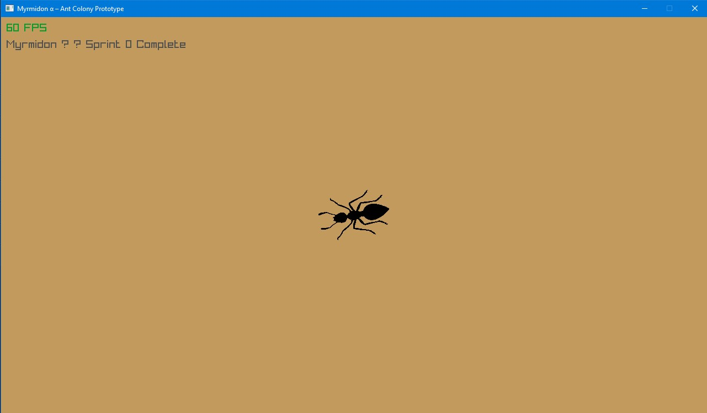

# 🐜 Myrmidon – Ant Colony Digital Pet

A real-time emergent ant colony simulator destined for a dedicated handheld device.  
Tamagotchi × Ant Colony Optimization × Real myrmecology.

Currently in active development – desktop prototype (Windows/Linux) → Raspberry Pi 5 → custom RK3588 handheld.

## Quick Start (VS Code + Clang)
```bash
git clone --recursive git@github.com:Drew-Woodz/ants.git
code ants          # open in VS Code
Ctrl+Shift+P → "CMake: Configure" → "CMake: Build"
F5 to run

## Sprint 0 – Proof of Life (Nov 19, 2025)
